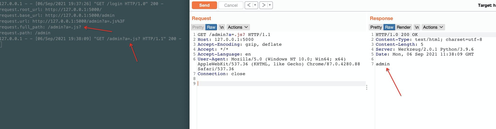

# URL FIlter 绕过 - Python 之 Flask

示例： https://twitter.com/chybeta/status/1435146635202285576

详细分析可见个人星球 [漏洞百出：URL FIlter 绕过 - Python 之 Flask](https://t.zsxq.com/Rn6i6Ey)



```
./start.sh

docker-compose logs -f 
```

